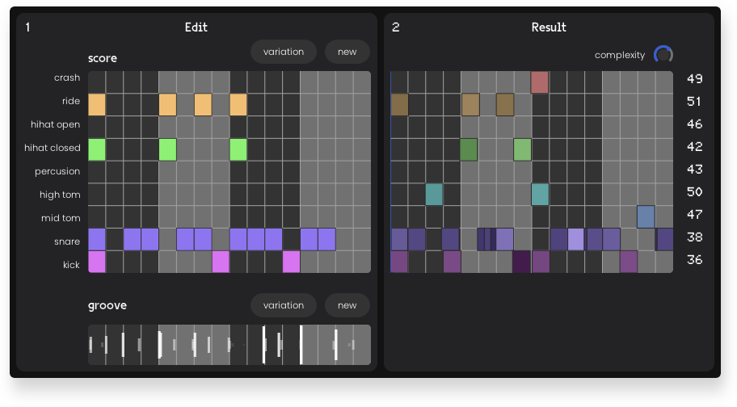
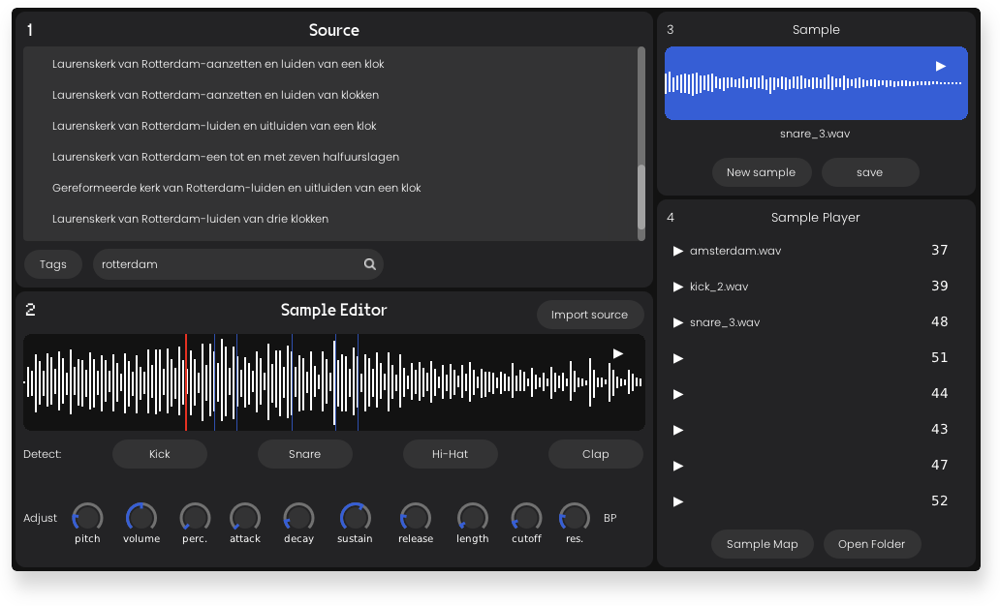

# WAIVE-Plugins

<p align="center">
    
</p>
<p align="center">
    AI x Archive music tools
</p>

<p align="center">
    
</p>

<p align="center">
    
</p>

A plugin suite that combines music, sound and MIDI generation with European cultural archives. 
Aims to be an offline, modular version of [WAIVE-Studio](https://www.waive.studio/) that can be integrated into your DAW.
Built with [DISTRHO Plugin Framework](https://github.com/DISTRHO/DPF) and [ONNX Runtime](https://github.com/microsoft/onnxruntime).

- **WAIVE-Midi**: a rhythmic pattern generator
- **WAIVE-Sampler**: a sample player, sample library and sample generator in one

Developed by [Arran Lyon](https://arranlyon.com) for [Thunderboom Records](https://www.thunderboomrecords.com). Contributions and pull-requests welcome, especially regarding Windows and MacOS releases.

### Download and Install
Currently, there is no installer provided, so you must install the plugins manually: 
1. Download and extract the latest archive from the [**Releases**](https://github.com/ThunderboomRecords/WAIVE/releases) page for your platform (currently only available for macOS Apple Silicon and Linux). You can find the download links under the **Assets** heading.
2. Choose which plugin format you prefer and place the corresponding bundle (e.g. `WAIVE_Sampler.vst3`) in your plugins path of your DAW:
    - Common (system-wide) plugin paths:
      
        |          |  VST2                                 |  VST3                                |  CLAP                                 |
        |----------|---------------------------------------|--------------------------------------|---------------------------------------|
        | macOS    | `Library/Audio/Plug-Ins/VST`          | `Library/Audio/Plug-Ins/VST3`        | `Library/Audio/Plug-Ins/CLAP`         |
        | Linux    | `/usr/lib/vst`                        | `/usr/lib/vst3`                      | `/usr/lib/clap`                       |
        | Windows  | `C:\Program Files\Common Files\VST2`  | `C:\Program Files\Common Files\VST3` | `C:\Program Files\Common Files\CLAP`  |
      
3. In your DAW, re-scan plugins if it does not do so automatically.

### Build Instructions
To build WAIVE-Plugins from source.

#### Pre-requisites
Requires statically built onnxruntime for your platform. You can download pre-built libraries from [csukuangfj/onnxruntime-libs](https://huggingface.co/csukuangfj/onnxruntime-libs/tree/main), or build them yourself (such as with [ort-builder](https://github.com/olilarkin/ort-builder/tree/bfbd362c9660fce9600a43732e3f8b53d5fb243a)).
Tested with 1.17.1.

Requires `cmake` and `ninja`:
- on Mac, with [homebrew](https://brew.sh/): ```$ brew install cmake ninja```
- on Linux: use your distributions package manager
- Windows: *coming soon*

Requires `vcpkg` and `pkg-config`:
- on Mac:
  ```shell
  $ brew install vcpkg pkg-config
  $ git clone https://github.com/microsoft/vcpkg "$HOME/vcpkg"
  $ export VCPKG_ROOT="$HOME/vcpkg"
  ```
  (you may wish to add the last line to your .bashrc or .zshrc to make it permanent)
- on Windows/Linux: [vcpkg installation instructions](https://learn.microsoft.com/en-gb/vcpkg/get_started/get-started?pivots=shell-cmd)


#### Linux/macOS
```shell
$ git clone --recursive https://github.com/ThunderboomRecords/WAIVE.git
$ cd WAIVE/
```
Copy the `lib/` and `include/` folders from the static built onnxruntime you downloaded in the prerequisite step into a new folder 
 `WAIVE/external/onnxruntime/`, then from project root:
 
```shell
$ mkdir build
$ cmake --preset=default
$ cmake --build ./build -j8 --config Release
```

The plugins are found in ```build/bin``` folder. Move your prefered format binary to your plugins folder (see [instructions](#installation) above).

#### Windows

*Coming soon*.


### Licenses

- [DPF](https://github.com/DISTRHO/DPF?tab=ISC-1-ov-file) ISC license
- [ONNX Runtime](https://github.com/microsoft/onnxruntime) MIT
- [libsndfile](https://github.com/libsndfile/libsndfile?tab=LGPL-2.1-1-ov-file) LGPL-2.1 
- [VG5000 font](https://velvetyne.fr/fonts/vg5000/) SIL Open Font License, Version 1.1
- [Poppins Light font](https://fonts.google.com/specimen/Poppins) SIL Open Font License, Version 1.1
- [kissfft](https://github.com/mborgerding/kissfft) BSD-3-Clause
- [Gist](https://github.com/adamstark/Gist) GPL-3.0 license
- [libsamplerate](https://github.com/libsndfile/libsamplerate) BSD-3-Clause
- [nlohmann/json](https://github.com/nlohmann/json) MIT
- [TinyOSC](https://github.com/mhroth/tinyosc/tree/master) ISC license
- [tinyfiledialogs](https://sourceforge.net/projects/tinyfiledialogs/) zlib/libpng license
- [POCO](https://github.com/pocoproject/poco) Boost Software License
