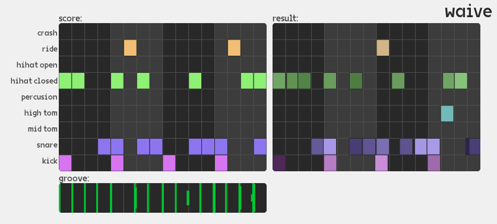

# WAIVE-Plugins


<p align="center">    
AI x Archive music tools
</p>

<p align="center">
    
</p>

A plugin suite that combines music, sound and MIDI generation with European cultural archives. 
Aims to be an offline, modular version of [WAIVE-studio](https://www.waive.studio/) that can be integrated into your DAW.
Built with [DPF](https://github.com/DISTRHO/DPF) and [PyTorch](https://pytorch.org/).


### Build Instructions
To build WAIVE-Plugins from source.

```bash
$ git clone --recursive https://github.com/ThunderboomRecords/WAIVE.git
```

#### Linux
Requires cmake

```bash
$ mkdir build
$ cd build

# download and extract libtorch from https://pytorch.org/get-started/locally/:
$ cmake -DCMAKE_PREFIX_PATH=/absolute/path/to/libtorch ..

$ cmake --build . --config Release
```

The plugins are found in ```build/bin``` folder. *TODO:* installation instructions.

#### Windows

*TODO*

#### MacOS

*TODO*
