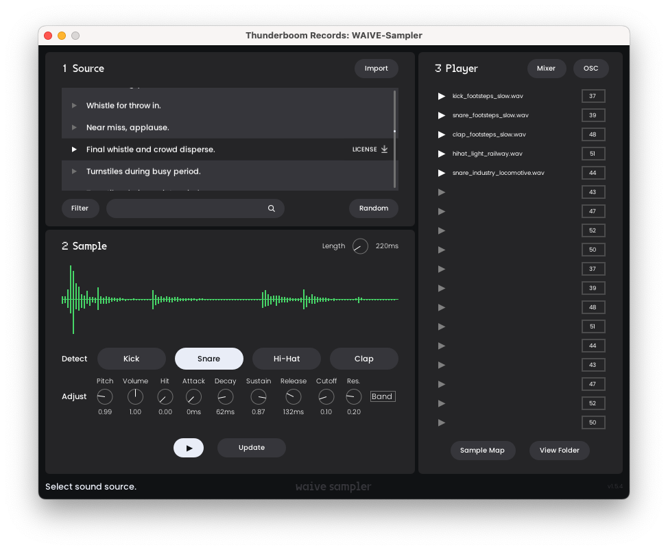

# WAIVE-Plugins

<p align="center">
    
</p>
<p align="center">
    AI x Archive music tools
</p>

<p align="center">
    
</p>

<p align="center">
    
</p>

A plugin suite that combines music, sound and MIDI generation with European cultural archives. 
Aims to be an offline, modular version of [WAIVE-Studio](https://www.waive.studio/) that can be integrated into your DAW.
Built with [DISTRHO Plugin Framework](https://github.com/DISTRHO/DPF) and [ONNX Runtime](https://github.com/microsoft/onnxruntime).

- **WAIVE-Sequencer**: a rhythmic pattern generator
- **WAIVE-Sampler**: a sample player, sample library and sample generator all in one

Developed by [Arran Lyon](https://arranlyon.com) for [Thunderboom Records](https://www.thunderboomrecords.com). Contributions and pull-requests welcome, especially regarding stability improvements and Windows release.

## Download and Install (for users)

> If you are reinstalled the plugin from an older, develpment version, you may need to delete the old database file as described in the [Troubleshooting](#waive-sampler-not-loading-sources-list) section.

1. Download the installer from the [**Releases**](https://github.com/ThunderboomRecords/WAIVE/releases) page for your platform (e.g. new Apple computers should use `macOS_arm64`, whereas older Macs with Intel chips should use `macOS_x64`). You can find the download links under the **Assets** heading. *More platforms coming soon!*
2. Open the installer and follow the steps.
3. In your DAW, rescan plugins if it does not do so automatically.

### Ableton Live Notes
- If you installed the plug-ins in the above directories, then make sure that "Use VST3 System Plug-in Folders" is On (same for VST2) in Settings > Plug-ins before rescanning.
- To use WAIVE-Sequencer, add this plugin to an empty MIDI track. Then, on a separate MIDI track add your instrument (e.g. WAIVE-Sampler) then set MIDI From to the name of the first track and make sure to set it to use Post-FX.

## Build Instructions (for developers)
If you want to build WAIVE-Plugins from source instead of using the provided installers/binaries, follow the instructions below.

### Pre-requisites
Requires statically built onnxruntime for your platform. You can download pre-built libraries from [csukuangfj/onnxruntime-libs](https://huggingface.co/csukuangfj/onnxruntime-libs/tree/main), or build them yourself (such as with [ort-builder](https://github.com/olilarkin/ort-builder/tree/bfbd362c9660fce9600a43732e3f8b53d5fb243a)).
Tested with 1.17.1.

Requires `cmake` and `ninja`:
- on Mac, with [homebrew](https://brew.sh/): ```$ brew install cmake ninja```
- on Linux: use your distributions package manager
- Windows: *coming soon*

Requires `vcpkg`:
- on Mac:
  ```shell
  $ git clone https://github.com/microsoft/vcpkg "$HOME/vcpkg"
  $ export VCPKG_ROOT="$HOME/vcpkg"
  ```
  (you may wish to add the last line to your .bashrc or .zshrc to make it permanent)
- on Windows/Linux: [vcpkg installation instructions](https://learn.microsoft.com/en-gb/vcpkg/get_started/get-started?pivots=shell-cmd)


### Linux/macOS
```shell
$ git clone --recursive https://github.com/ThunderboomRecords/WAIVE.git
$ cd WAIVE/
```
Copy the `lib/` and `include/` folders from the static built onnxruntime you downloaded in the prerequisite step into a new folder 
 `WAIVE/external/onnxruntime/`, then from project root:
 
```shell
$ mkdir build
$ cmake --preset=default -DCMAKE_BUILD_TYPE="Release"
$ cmake --build ./build -j8 --config Release
```

The plugins are found in ```build/bin``` folder. Move your prefered format binary to your plugins folder (see [instructions](#installation) above).

### Windows
Install Visual Studio Code (2022) with C++ and CMake tools. Run the build commands in Developer Command Prompt (not Powershell).

```shell
C:\path\to\WAIVE>cmake --preset="windows" -DCMAKE_BUILD_TYPE="Release" -A x64
C:\path\to\WAIVE>cmake --build build -j8 --config Release
```

## Troubleshooting
### WAIVE-Sampler not loading sources list
- Make sure you are connected to the internet
- Click "View Folder" button to open up the location the database is saved in you file browser. Delete the file WAIVE.db, close and remove the plugin from the track, and re-add it and re-open.
  - On macOS, this is located at `/Users/[your username]/Library/Application Support/WAIVE`
 
## About
WAIVE-Plugins are built on top of several bespoke music and audio analysis models in order to create a unique and custom musical toolbox. These models will continue to be fine-tuned and updated on new data. 

**WAIVE-Sequencer** utilises a flexible approach of modelling rhythmic data first outlined by Jon Gillick and collaborators. This works by encoding a percussion loop into it's *Score* and *Groove* components, then a model (a Variational AutoEncoder, *VAE*) is trained to combine them into a final output sequence. By adjusting the groove information, the same pattern (score) can be played in a different style. For the plugin, we also trained 2 smaller models (VAEs) that can encode the training data and can generate new Grooves and Scores in a variety of styles. 

We use a combination of MIDI data and raw audio to collect rhythm information to train the models. In the case of raw audio, first the percussion instruments are isolated using [demucs](https://github.com/facebookresearch/demucs), then a method (Non-Negative Matrix Factorisation, demoed [here](https://www.audiolabs-erlangen.de/resources/MIR/2016-IEEE-TASLP-DrumSeparation/AmenBreak)) to further separate the individual percussion instruments is used to extract the score and groove information. 

Rhythmic datasets include:
- [Groove MIDI Dataset](https://magenta.tensorflow.org/datasets/groove) from Magenta
- [Folkloras](http://etnomuzikologai.lmta.lt/), Baltic folk music archive.
- [Free Music Archive](https://freemusicarchive.org/) selected electronic dance tracks

**WAIVE-Sampler** uses common techniques from machine listening to make measurements (called "features") of the audio, giving each sound a unique fingerprint and description of the audio content which can then be interpreted by other algorithms. At the same time, another method attempts to identify when percussive moments (called "onsets") occur using Complex Spectral Difference. The features are used to automatically identify appropriate moments in the Source audio that could be used for different drum hits, e.g. onsets that contain a broadband of frequency content can be shaped to make a snare sound.

For the Sample Map, the (log) Mel Spectrogram of the sample is measured, which computes a detailed representation of the frequency content of the audio. A simple, pretrained fully connected neural-net reads the measured features and outputs a 2D coordinate on where the audio sample should be placed on the map, e.g. such that kick drum sounds a grouped together, away from the hi-hat samples.

For the Tag cloud, we use an off-the-shelf word embedding model ([GloVe](https://nlp.stanford.edu/projects/glove/)) to produce a 2D representation (using TSNE dimensionality reduction) of all the tags in the database, such that semantically similar tags a clustered together to enable easier exploration of the available sources.
  
#### References
- [Jon Gillick, Adam Roberts, Jesse Engel, Douglas Eck, and David Bamman (2019) 'Learning to Groove with Inverse Sequence Transformations.'](https://magenta.tensorflow.org/datasets/groove), International Conference on Machine Learning 2019 (ICML). 
- [Gillick, J., Yang, J., Cella, C.-E. and Bamman, D. (2021) ‘Drumroll Please: Modeling Multi-Scale Rhythmic Gestures with Flexible Grids’](https://transactions.ismir.net/articles/10.5334/tismir.98#42-data-representations-for-comparison), Transactions of the International Society for Music Information Retrieval, 4(1), p. 156–166

### Licenses

- [DPF](https://github.com/DISTRHO/DPF?tab=ISC-1-ov-file) ISC license
- [ONNX Runtime](https://github.com/microsoft/onnxruntime) MIT
- [libsndfile](https://github.com/libsndfile/libsndfile?tab=LGPL-2.1-1-ov-file) LGPL-2.1 
- [VG5000 font](https://velvetyne.fr/fonts/vg5000/) SIL Open Font License, Version 1.1
- [Poppins Light font](https://fonts.google.com/specimen/Poppins) SIL Open Font License, Version 1.1
- [kissfft](https://github.com/mborgerding/kissfft) BSD-3-Clause
- [Gist](https://github.com/adamstark/Gist) GPL-3.0 license
- [libsamplerate](https://github.com/libsndfile/libsamplerate) BSD-3-Clause
- [nlohmann/json](https://github.com/nlohmann/json) MIT
- [TinyOSC](https://github.com/mhroth/tinyosc/tree/master) ISC license
- [tinyfiledialogs](https://sourceforge.net/projects/tinyfiledialogs/) zlib/libpng license
- [POCO](https://github.com/pocoproject/poco) Boost Software License
